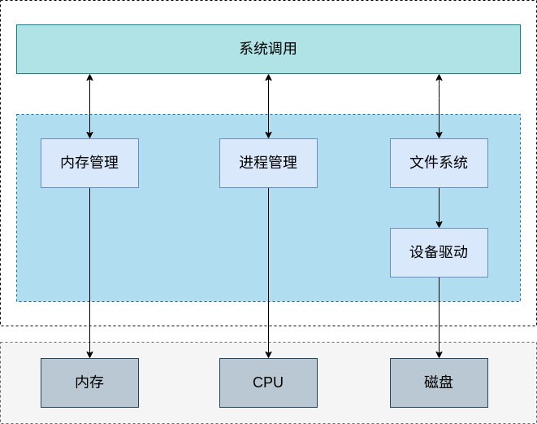
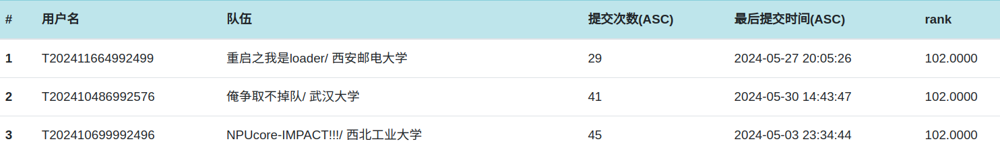

# kernel-travel

## 项目简介

kernel-travel 是由 重启之我是loader 三名成员共同开发的基于 LoongArch 的架构的64位操作系统。考虑到未来对于多架构的适配，该系统采用 kbuild 编译框架对项目进行构建，目前支持 LoongArch 架构的硬件开发板（2k1000、3A5000）。

kernel-travel 包含有五大模块，分别为：内存管理、进程管理、文件系统、设备驱动、系统调用。

### 区域赛

在区域赛阶段，kernel-travel 自系统启动阶段开始，完成了对内核基本功能的编写，并在此基础上实现了大赛要求的32个系统调用通过了比赛给出的所有测试程序。

### 国赛第一阶段

在国赛第一阶段中，考虑到要同时兼容多种文件系统，我们在原先的基础上，将不需要依赖底层文件系统的操作抽离出来。参考 Linux 内核源码，引入通用文件模型，形成 VFS 层。并对开源 ext4 文件系统库 lwext4 进行移植与适配。同时我们根据给出的测试指标，对 busybox 进行了适配。在初赛的基础上新增了如 writev 等系统调用，并进一步完善了 mmap、mount 等系统调用。

## 文档列表

文档位于 kernel-travel/doc 目录下。

环境配置：

* [编译并运行kernel-travel](./doc/编译并运行kernel-travel.md)
* [gdb调试方法](./doc/安装x86环境下支持调试loongarch体系结构的gdb.md)
* [快速启动](./doc/快速启动.md)

进程管理：

* [任务的创建与切换](./doc/任务创建与切换.md)
* [异常处理与时间](./doc/异常处理与时间.md)

设备驱动：

* [pci总线驱动](./doc/pci总线驱动.md)
* [磁盘驱动](./doc/磁盘驱动.md)

内存管理：

* [虚拟内存管理](./doc/虚拟内存管理.md)
* [物理内存管理](./doc/物理内存管理.md)

文件系统：

* [Fat32文件系统.md](./doc/Fat32文件系统.md)
* [文件系统架构与VFS](./doc/文件系统.md)
* [适配lwext4.md](./doc/适配lwext4.md)

其他：

* [kernel-travel的编译链接与初始化](./doc/kernel-travel的编译链接与初始化.md)
* [适配busybox](./doc/适配busybox.md)
* [适配硬件开发板](./doc/板子.md)

## 参考资料

* [操作系统真相还原](https://github.com/yifengyou/os-elephant)
* [兰州大学 - MaQueOs](https://gitee.com/dslab-lzu/maqueos)
* [种田队 - 2023年优秀作品](https://gitlab.eduxiji.net/202310006101080/zhongtianos)
* [dim-sum](https://gitee.com/xiebaoyou/dim-sum)
* [Linux内核源码](https://elixir.bootlin.com/linux/latest/source)
