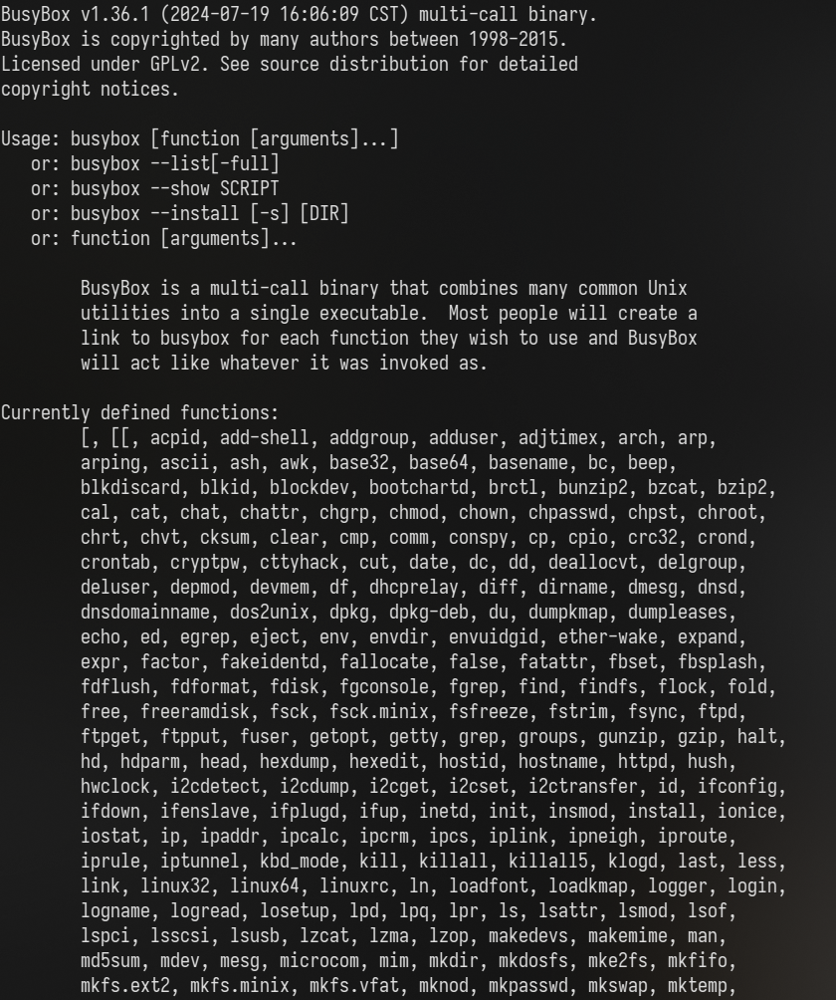

# Busybox 适配


### busybox 编译

#### 关于工具链muslc
```
编译 LoongArch musl libc库
git clone https://github.com/LoongsonLab/oscomp-musl-1.2.4.git

# 保证交叉编译器已经正确安装
./configure --target=loongarch64-linux-gnu CFLAGS="-mabi=lp64d" --prefix=/opt/loongarch-muslc


make -j 16
make install -j 16
```
在.bashrc里修改PATH添加相关目录
```
#添加交叉编译工具到PATH
export PATH=$PATH:[your tools]
```

## 下载Linux引入相关头文件
```
make ARCH=loongarch INSTALL_HDR_PATH=../temp headers_install
```
更改busybox的Makefile
```
CFLAGS		:= $(CFLAGS) -I /**/include
```

### 修改编译选项
```
make defconfig
CONFIG_TC=y ==> CONFIG_TC=n

nvim scripts/kconfig/lxdialog/check-lxdialog.sh
main ==> int main()

make menuconfig 设置静态编译
make  CROSS_COMPILE=musl- -j 16
make  CROSS_COMPILE=musl- install -j 16
```

### 制作包含busybox的fat32镜像

### 将busybox 读入内存
像之前读sdcard那样，把sdcard替换为自己制作的。
fat32.img复制到/tmp/qemu，然后调整runqemu.sh
```
sudo docker cp fat32.img os-contest:/tmp/qemu/fat32.img

>>runqemu.sh:
-hdb fat32.img
```
# 适配 muslc

由于 busybox 是一个复杂的用户程序，为了验证muslc的适配情况并方便后续调试，我们先对 printf 函数进行了支持。

在此基础上编写了一个小 demo.

```c
//user_prog.c
int main(void)
{
	int count = 0 ;
	char filepath[20];

	umemset(filepath,0,sizeof(filepath));
	ustrcpy(filepath,"/sdcard/hello");
	char *argv[] = {"/sdcard/hello", NULL};
	char *envp[] = {NULL};
	//ustrcpy(argv[1],"sh");

	int pid = fork();
	if (pid == 0){
		execve(filepath,(char**)argv,NULL);
	}

	int status;
	int childpid = wait(&status);
	write(1,"\nhello exit\n",64);
	while(1) {
	}
}
```
用户程序 hello.c
```c
#include <stdio.h>
int main()
{
    printf("hello-world...\n")
}
```

运行结果：




## 适配日记

运行时出现
```
Error: unkown opcode. 00000000004108b0: 0xfa1e0ff3
Error: unkown opcode. 90000000901ba79c: 0x0
```

1.busybox 编译出的机器码无法被识别
验证方法：如果确实运行到那一步，并且当前机器码与busybox中一致，则说明是这个原因。
验证结果：跳转的地方是0x00000000004108b0，确实运行到那里了
现在查看是否与Busybox中一致。
查看该虚拟地址是从Busybox的哪里移过来的
打印得到的结果:
```
vaddr=400000:p_offset=0
vaddr=401000:p_offset=1000
vaddr=5c9000:p_offset=1c9000
vaddr=6372e0:p_offset=2362e0
```
推得，vaddr=4108b0,busybox的offset=0x108b0
检查了一下，确实一毛一样：
```
000108b0: f30f 1efa 31ed 4989 d15e 4889 e248 83e4
```

仔细想来，这个busybox我在电脑上运行了一下是好的。然鹅，我的电脑并非龙芯架构，所以反而是错的。
检查一下
```
busybox: ELF 64-bit LSB executable, x86-64, version 1 (GNU/Linux)
```
果真如此
检查修改busybox交叉编译流程
发现make install 也需要加CROSS_COMPILE,或许它重新又编译了一遍？
重试

出现
```
!!!!! error !!!!!
filename:drivers/../lib/kernel/bitmap.c
line:52
function:bitmap_set
```
是内存管理的问题。
经检查，启动进程前分配的虚拟页是0x120000000，超出当前内核虚拟内存范围0x40000000
改成0x8000000000分配栈时出现了一个特别大的数
原因是(1<<(9+9+9+12))会被截断变成0,改成1UL就好了。


```
jump to proc... at 200004a4
Warning: page_size is 0
```
1.加载的虚拟地址未完全有效关联物理地址

/********* 正确原因 ************/
2.跳错地方了，真的入口不在那
查看了下busybox`Entry point 0x1200004a4`。
比较两个数据应该是在哪里被截断了,找到在这个函数
```
int sys_exeload(const char *path)
```

好吧，改了还有类似的问题：
```
jump to proc... at 1200004a4
Warning: page_size is 0
Error: unkown opcode. 90000000901b9d9c: 0x0
Error: unkown opcode. 90000000901ba79c: 0x0
qemu-system-loongarch64: terminating on signal 2
```
gdb进去仔细查看了下，已经开始成功执行代码了，应该是执行到哪步突然出的错。
进一步的观察：
1.是在加载数据时出错的
通过读出寄存器的数值，查看加载的内存地址具体是多少,然后追查为何那里会有问题。
读入地址：0x120284178
检查下是否在phdr所指示的范围内？
情况一：在范围内，但是没分配到内存
情况二：在范围内也分配到了，但是后续某些操作干扰了使得那块内存失效。
情况三：不在指示范围内

打印的范围：
```
range:120000000 - 120210ef4
range:1202150f8 - 12027e1c0
```
看样子是情况三
查看busybox中相应位置是个什么段
检查一下段的范围，发现第二个段的范围应该是`0x00000001202150f8 - 0x120285090`
原因是我把p_filesz与p_memsz混为一谈了。有些在内存某些地方是被占用的，只不过他们不在文件中罢了


```
Error: unkown opcode. 90000000901b9d9c: 0x0
Error: unkown opcode. 90000000901ba79c: 0x0
```

更多详细细节:
在执行
```
ldptr t0 0
```
其中t0=0x4e03043017fc0328
转移到
```
0x90000000901b1004 <exception_handlers+4100>
```

首先这个t0的值明显不对劲，检查一下初始赋值，查清为0
然后这个<exception_handlers+4100>具体是什么，查明是地址错误
所以是Busybox程序自己的问题？亦或者是某些内存没有效加载程序？
进一步调查结果显示
```
0x1200004bc     ld.d            $a1, $sp, 0
```
起因是这里$sp=0x8000000000的时候，加载了不存在的东西
其实应该是要有东西的，就是argv和argc，但我没写好，现在补上
1.制作程序入口向栈中推入argv和argc，其他照常
本来是寄存器传参，没有用到栈
这里既然是赋值给a1，意味着原来直接给a1赋值传参的思路是错的，这边用栈转参

2.在内存空间内专门留一块存放argv
查看_start
```c
	int argc = p[0];
	char **argv = (void *)(p+1);
```

改变一下内存格局，最上面放argv，下面是栈。
```
argv[argc-1]的内容
......
argv[1]的内容
argv[0]的内容
---------- stack
argv[argc-1]
......
argv[1]
argv[0]  <======[argv]
argc     <======[p]
```
结果运行时
```
Error: unkown opcode. 90000000901cf500: 0x0
Error: unkown opcode. 90000000901d0d00: 0x0
```
检查是不是内核栈出了些问题
1.超出内核栈的范围
2.压栈破坏了pcb
没发现以上问题
发现是原来的用户栈中的存path，经改动后访问不了了
```c
malloc_usrpage(cur->pgdir,(uint64_t)uargs);
```
检查下`path=0x7fffffdfc0`相关的页表是否被改变
这是初始信息：
```
(gdb) x/gx 0x90000000a2015000+0xff8
0x90000000a2015ff8:     0x90000000a201b000
(gdb) x/gx 0x90000000a201b000+0xff8
0x90000000a201bff8:     0x90000000a201c000
(gdb) x/gx 0x90000000a201c000+0xfe8
0x90000000a201cfe8:     0x90000000a201a00f
```
深入调研后发现不是这个问题，只不过是page_table_add后暂时把tlb里的东西刷新了罢了。至少页表没被破坏
实际是运行到了用户态
```
0x0000000120000310
```


增加了，但是没什么用，看来很可能不是这个原因
在busybox的init_main中增添了printf，但并没打印出任何东西就死了，那时还没有用到argv。难道是init_main之前还有一段程序？
查看符号表，没有符号表，CFLAGS添加-g，还是没有。
看了下busybox的makefile，发现默认是stripped，修改Makefile,添加SKIP_STRIP = y

```
00000001200d2e98 T init_main
```
现在的Entry在 0x12010e38c
```
000000012010df00 T __trunctfdf2
000000012010e398 T _start
```
怪了，应该跳到_start吧，readelf读出来的也是000000012010e398 
哦，原来是忘记重新制作fat32镜像了，犯了个低级错误，尴尬。。。

gdb看一下具体在哪死了
大概这个范围
```
0x00000001200e4224 in ?? ()
0x00000001200e4228 in ?? ()
0x00000001200e422c in ?? ()
0x00000001200e4230 in ?? ()
0x00000001200e4234 in ?? ()
0x00000001200e4238 in ?? ()
0x00000001200e423c in ?? ()
0x00000001200e3fa0 in ?? ()
```

查一下符号表
```
00000001200e4210 T __libc_start_main
00000001200e426c T clearenv
00000001200e42b8 T getenv
```
最终的死亡地点在
```
00000001200e3fa0 T __init_libc
```
离谱，我重新试了一遍，这次居然没出现这问题，一切正常地执行到系统调用。
又试了几次也是这样，那前面是怎么回事？
算了不管了，继续把。

第一个系统调用号为96
于musl源码中可找到
`#define __NR_set_tid_address            96`
搜索了一下干什么的，简单实现了下


接下来：291
statx，这个应该实现过了，看看哪里出问题了
没有这个东西：/etc/busybox.conf
当前fat32.img中只放入了busybox，busybox需要读取这个作为配置，所以我还得把这个带上
找了下我本机就没有这个文件，但是Busybox还能运行，说明这个文件并非绝对必要，所以是sys_statx缺陷，修改成如果没有这个文件就直接退出

为了方便，在do_syscall执行前后增添打印系统调用号,方便定位哪些系统调用需要修改


```
!!!!! error !!!!!
filename:mm/memory.c
line:47
function:free_page
```

错误原因是
```
free_page(*ptep&0xfffffffffffff000);
```
*ptep 给出一个明显不合理的值

```
uint64_t* ptep = reverse_pte_ptr(pdir,vaddr);
```
1.reverse_pte_ptr这个函数写的不对
2.页表本身数据不对


寻找进入init_main前的代码：
查找_start
怪事：
1.hello打印语句执行了，但是我前面设置的syscall没有
难道是我写的不对？看看printf的syscall是怎样的
2.运行hello打印和syscall都没有，它到_start了吗？

似乎是我的编译未对busybox生效。
解决： LDFLAGS添加
```
LDFLAGS		:= $(LDFLAGS) -L/opt/loongarch-muslc/lib
```
还有，把之前的musl的删干净再重新编译


调试比赛官方的busybox
```
0x0000000120194020 in ?? ()
0x90000000901c1004 in exception_handlers ()
0x90000000901c1008 in exception_handlers ()
0x90000000901c100c in exception_handlers ()
0x90000000901c1010 in exception_handlers ()
0x90000000901d0348 in memblock_memory_init_regions ()
```
给出的EXCCODE表明为地址错误

```
 0x12019403c     st.d            $t0, $s2, 1112(0x458)
```


sys_mmap起始 $s0
```
r25            0x2f64726163006873  3414980180052043891
```

起因是这么一句：加载地址为0处的东西
```
0x120193f28     ldptr.d         $s2, $t0, 0

```
有两种可能
1.t0正常，加载的地址本应有有意义的数据
2.t0不正常，在之前的赋值错误

查找busybox是否真有这个段
没有这个段，说明应该是t0错误，查找哪里有为t0赋值

获知 `argv[0]` 刚好是这个值，回过头改一下`argc`与`argv`

`__libc_start_main` 中使用到了argv
```c
	char **envp = argv+argc+1;
```
由此调整args的布局
```
envp[argc-1]的内容
......
envp[1]的内容
envp[0]的内容
argv[argc-1]的内容
......
argv[1]的内容
argv[0]的内容
---------- stack
envp[envs]
envp[envs-1]
......
envp[1]
envp[0]
argv[argc]
argv[argc-1]
......
argv[1]
argv[0]  <======[argv]
argc     <======[p]
```

顺便看下后续它是如何使用args的

```c
	for (i=0; envp[i]; i++);
	libc.auxv = auxv = (void *)(envp+i+1);
```
还有个这！辅助数组auxv 在env数组的后面，以`[键:值]`的方式排布
> ELF auxiliary vectors are a mechanism to transfer certain kernel level information to the user processes. 
An example of such an information is the pointer to the system call entry point in the memory (AT_SYSINFO);
this information is dynamic in nature and is only known after kernel has finished loading.

```c
	for (i=0; auxv[i]; i+=2) if (auxv[i]<AUX_CNT) aux[auxv[i]] = auxv[i+1];
```
因为Program Headers 本来就在被加载的段之中，所以可以从段中找到并获取


疑似在`__init_libc` 处停止(奇怪的是，加个printf竟然好了...)。
检查下auxv的数值是否与预想的一致
是的
发现内存数据到0x120000ffc戛然而止，跳到的函数opcode为0导致了这场错误
加载时read错误，更改后成功运行


在这里卡死
```c
	INIT_G_var();
```

错误信息：
```
Error: unkown opcode. 90000000901d1174: 0x0
Error: unkown opcode. 90000000901d0d74: 0x0
Warning: page_size is 0
Error: unkown opcode. 90000000901cfb74: 0x0
Error: unkown opcode. 90000000901cf774: 0x0
```
1.sys_mmap返回的参数不对，导致去一个奇怪的地址吗
查看几次mmap返回的地址，对照着函数看看
第一次：0x800000000
第二次：0x800002000
第三次：0x800003000


```c
	for (i=0; pn[i]; i++) if (pn[i]=='/') __progname = pn+i+1;
```
这个pn这么来的
```c
	if (!pn) pn = (void*)aux[AT_EXECFN];
```
这个AT_EXECFN好像确实没有赋值，赋值一下看看

还是不行，仔细看看是`aux[AT_RANDOM]`这个取值时错误


busybox sh 解析busybox_testcode
```c
char *argv[] = {"/sdcard/busybox","sh","busybox_testcode.sh",NULL};
```
没有成功解析,不知道出了什么错提前退出了
exitcode=2，查了下是命令（或参数）使用不当
检查下argv是否如愿,有无问题
检查了，没问题


