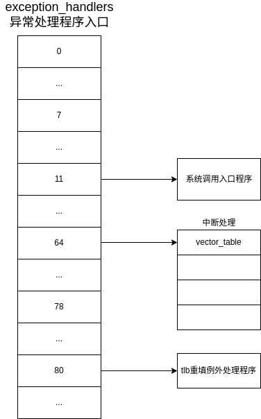
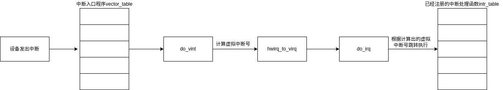

# 异常处理与时间

## 异常处理

在 LoongArch 架构下，将不同的异常进行编号, 其异常处理程序入口地址采用 “ 入口页号与页内偏移进行按位逻辑或” 的计算方式。

因此在 kernel-travel 中使用占据一页物理内存的数组 exception_handlers 存储异常处理程序的入口地址。

异常编号与对应处理程序的关系如下图所示：



### 中断处理

龙芯架构下的中断采用线中断，中断被视作一类特殊的异常进行处理。

因此在具体计算中断处理程序入口地址时将 SWI0(软中断) ~ IPI（核间中断） 这 13 个中断依次 “ 视作” 异常编号 64 ~ 76 的异常，用异常处理程序入口地址的统一计算方式进行计算。 

```c
#define EXCCODE_INT_START   64
#define EXCCODE_INT_END     78
```

#### 中断流程

A. 当 CSR. ESTAT 中 IS 域的某位为 1 且对应的局部中断使能和全局中断使能均有效时, 处理器将响应该中断。

B. 保存状态。

C. 各例外和中断之间的入口地址间距是 $2^{VS}$​条指令。根据hwirq进入相应中断处理程序入口处开始执行，该程序完成了硬件中断处理到软件中断处理的映射，即 **hwirq** 到 **virq** 的映射。

D. 处理结束，恢复保存的状态。

E.  返回原来的执行流。



#### 中断初始化设置

`per_cpu_trap_init` 

​      |__     `setup_vint_size` 设置处理程序之间的间距

​      |__     `configure_exception_vector` 配置 `exception_handlers` 为普通例外与中断处理程序入口。

`trap_init` 

​      |__  清空中断状态

​      |__  初始化中断处理入口程序

`trap_init` 将vector开始的 EXCCODE_INT_START～EXCCODE_INT_END 中断处理程序，写入从exception_handler设置的eentry开始相应的偏移。

vector_table 中 hanle_vint_\num是中断的入口，定义如下。

```c
SYM_FUNC_START(handle_vint_\num)
	BACKUP_T0T1
	SAVE_ALL
	addi.d	t0, zero, \num
	cfi_st	t0, PT_HWIRQ, 0
	move	a0, sp
	move	a1, sp
	la.abs	t0, do_vint
	jirl	ra, t0, 0
	RESTORE_ALL_AND_RET
SYM_FUNC_END(handle_vint_\num)
	.endm
```

这里的 do_vint 完成hwirq到virq的转化并跳转执行软件中断处理程序。结束任务后恢复保存的状态，返回。

#### 软中断

内核执行的任务中，有些是不紧急的。我们把它设置为可延迟中断，可在开中断下执行，这样就有更多时间执行那些相对更为紧迫的任务，有助于使内核保持较短的响应时间。

软中断的行为

```c
struct softirq_action
{
    void (*action) (void*);
    void *data;
};
```

在处理完硬中断后，会根据softirq_active中是否置位，执行已注册的softirq_action。

##### 相关函数

与软中断处理相关的函数如下所示
`open_softirq` 注册软中断
`raise_softirq` 更改softirq_active，激活软中断
`do_softirq` 执行软中断

### 系统调用

1. 系统调用的处理流程


2. 系统调用的注册

kernel-travel [系统调用](../kernel/syscall_init.c)在函数syscall_init被注册。

## 时间

定时器中断的中断源来自于核内的恒定频率定时器。被处理器核采样记录在 CSR.ESTAT.IS[11]位。

**设置定时器：**

--->自动装载时间计数、开启局部中断使能控制位。

```c
void trap_init(void)
{
    unsigned long tcfg = 0x0400000UL | (1U << 0) | (1U << 1);
	write_csr_tcfg(tcfg);
    ecfg = read_csr_ecfg();
	change_csr_ecfg(CSR_ECFG_IM, ecfg | 0x1 << 11);
}
```

每过一段时间，发一个中断。收到这个中断增加 ticks作为计时单位。


#### 低延时定时器

```c
static struct timer_vec tvecs[LVL_DEPTH];

struct timer_vec {
    unsigned int index;
    struct list vec[LVL_SIZE];
};
```

一共有7个级别的`timer`。 每个级别用 6 个比特位来表示，每一级下有 $2^6=64$个桶。

每个桶都是一个 `timer_list` 的链表。

```c
struct timer_list {
    struct list_elem *elm;
    unsigned long expires;
    void (*func)(unsigned long data);
    unsigned long data;
};
```

计时器作为软中断，以 tick 为单位检查 struct timer 是否到期。

如果把所有timer都串到一个timer_list，在每一个tick到来时扫描它明显太费时。但是，如果把所有ticks都整一个这个链表，耗费的储存空间太大了，所以这里选择时间轮。

第一级每$64^0$个 tick 检查一次，执行到期的timer。

第二级每$64^1$​个 ticks 检查一次，如果到了，说明该timer将在64ticks中到期，把它转移到第一级。

第三级每$64^2$个ticks检查一次。

.....


每一级的 `tvecs[level].index` 代表现在检查到哪个桶了

`run_timers`  按照上面的检查规则，推动 index 向前推进。将第一级index处的timer_list中的timer取出来执行。

`cascade_timers` 被run_timers调用，用于推进二级及以上的index。并把index处的timer拉到低一级。


##### 相关内部函数：

`internal_add_timer`  添加timer

`calc_wheel_idx` 根据还差多少时间到期决定放入哪一级；

`calc_index` 计算 idx，我们在添加 `timer` 的时候可以根据它来找到插入的桶。


##### 提供接口：

`add_timer` 添加 timer

`mod_timer` 修改某个timer

`del_timer` 删除 timer

