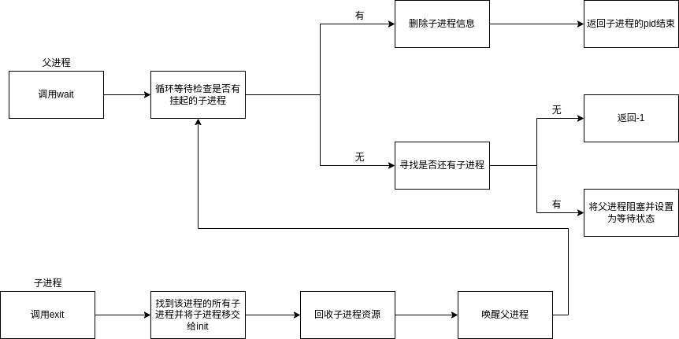
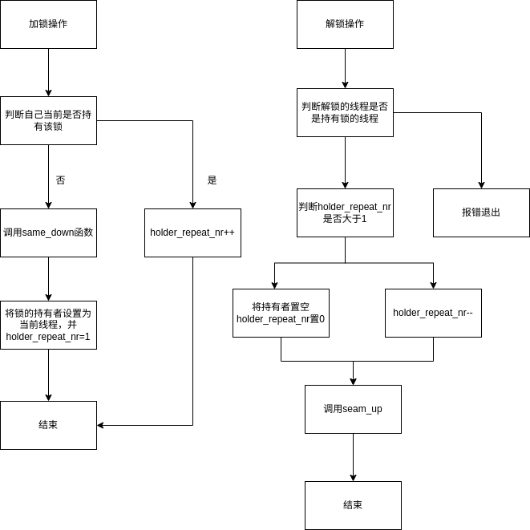

# 任务创建与切换

每一个任务都有一个控制块，记载了任务的各种信息。

```c
struct task_struct {
    uint64_t *self_kstack;          // 内核调度栈指针，指向进程的内核栈顶。
    thread_func *function;          // 线程函数指针，用于指向线程的入口函数。
    void *func_arg;                 // 线程函数参数。
    struct thread_struct thread;    // 线程状态信息结构体。
    struct tms time_record;         // 记录进程的时间信息。
    struct start_tms start_times;   // 记录进程开始时间的信息。
    pid_t ppid;                     // 父进程 ID。
    pid_t pid;                      // 进程 ID。
    enum task_status status;        // 进程的当前状态
    int16_t exit_status;            // 进程退出状态码。
    char name[TASK_NAME_LEN];       // 进程名称。
    uint8_t priority;               // 进程的优先级。
    uint8_t ticks;                  // 进程能运行的时间片数。
    uint32_t elapsed_ticks;         // 自进程创建以来的已运行时间片数。
    struct virt_addr usrprog_vaddr; // 用户程序的虚拟地址信息。
    struct list_elem general_tag;   // 进程在一般队列中的标记，用于调度。
    int fd_table[MAX_FILES_OPEN_PER_PROC]; // 进程的文件描述符表。
    char cwd[MAX_NAME_LEN];         // 进程的当前工作目录。
    struct Dirent* cwd_dirent;      // 进程当前工作目录的目录项结构指针。
    struct list_elem all_list_tag;  // 进程在所有进程队列中的标记。
    uint64_t pgdir;                 // 进程的页表地址。
    u32 asid;                       // 进程的地址空间标识符（用于区分不同进程的地址空间）。
    struct mm_struct *mm;           // 进程的内存管理结构体，管理进程的内存。
    uint32_t stack_magic;           // 栈的魔数，用于检测栈溢出。
};
```

* kernel-travel 把线程作为调度的基本单位。
* self_kstack 指向该线程的内核栈，其中指向的保存了线程执行的上下文信息。通过将寄存器 中内容的切换为指针 self_kstack 指向的地址来达成线程之间切换的目的
* 进程与线程的主要区别在进程有自己的虚拟空间。线程的pgdir为零，进程的pgdir指向进程的PGD。


## 任务创建与销毁

### 线程的创建

`thread_start` 创造线程

1.初始化任务控制块。

2.将任务控制块加入到`thread_ready_list` 和 `thread_all_list` 中。

### 进程的创建

`process_execute` 创造进程

1.按创造线程的流程走。

2.在线程的基础上创建页表并初始化管理虚拟内存的位图。

`sys_fork` 系统调用，复制父进程。所有进程均 fork 自 init 进程，该进程在系统初始化时创建。


跟 `process_execute` 差不多，但是复制自父进程，包括任务控制块以及内存中的内容。

#### 设置页表，填写物理内存

CPU 复位结束后将进入直接地址翻译模式。该模式CSR.CRMD 中的 DA 域为 1 且 PG 域为 0。直接映射配置窗口共设置有四个,前两个窗口可同时用于取指和 load/store 操作,后两个窗口仅用于load/store 操作。

经过`head.S`的设置，到`start_kernel`时已经是开了窗口的状态，一致可缓存的内存空间。0x9000000000000000 ~ 0x9000FFFFFFFFFFFF 被映射到物理地址空间 0x0 ~ 0xFFFFFFFFFFFF 上。

用户进程的pcb与页表保存在内核空间（直接窗口映射），不需要建立页表映射关系。而给用户进程的代码块和栈分配的物理页需与虚拟地址建立映射关系。


### 销毁

进程结束调用 `sys_exit` ， 回收分配的页框。此时该进程变成僵尸进程，只有任务控制块存在。

父进程调用wait()后会提取子进程的退出状态，并回收任务控制块。





## 任务切换

切换时机：任务时间片用完，即控制块中的ticks为零。或者其他需要被调度的情况。

任务控制块中有个 `thread_struct` ，保存着被切任务的上下文。

```c
struct thread_struct {
    /* 主处理器寄存器 */
	unsigned long reg01, reg03, reg22; /* ra sp fp */
	unsigned long reg23, reg24, reg25, reg26; /* s0-s3 */
	unsigned long reg27, reg28, reg29, reg30, reg31; /* s4-s8 */

	/* __schedule() 返回地址 / 调用帧地址 */
	unsigned long sched_ra;
	unsigned long sched_cfa;

	/* CSR 寄存器 */
	unsigned long csr_prmd;
	unsigned long csr_crmd;
	unsigned long csr_euen;
	unsigned long csr_ecfg;
	unsigned long csr_badvaddr; /* Last user fault */

	/* 临时寄存器 */
	unsigned long scr0;
	unsigned long scr1;
	unsigned long scr2;
	unsigned long scr3;

	/* Eflags 寄存器 */
	unsigned long eflags;
};
```

在schedule()的时候激活用户进程的pdir（一级页表）。

`switch_to` 保存当前任务上下文，并根据下一个任务的控制块中的`thread_struct`切换到下一个任务。


## 任务间的同步机制

kernel - travel 中实现了信号量与互斥锁来解决竞争与同步的问题。

```c
/*信号量结构*/
struct semaphore {
    uint8_t value;
    struct list wait_list;//在此等待的任务队列
};

/*锁结构*/
struct lock {
    struct task_struct* holder;//锁的持有者
    struct semaphore sema;
    uint32_t acquire_nr;
};
```


