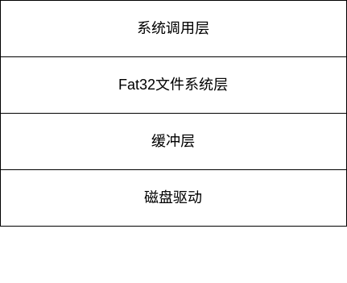
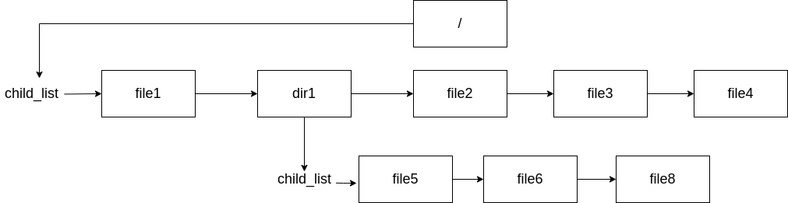

# 文件系统

在 kernel-travel 中文件系统采取多层次的实现方式



## 磁盘驱动层

```c
void block_read(uint64_t base_addr, uint64_t count, uint64_t buffer, uint8_t port_num)
void block_write(uint64_t base_addr, uint64_t count, uint64_t buffer, uint8_t port_num) 
```

## 缓冲层

由于每次I/O操作要耗费大量的时间与计算机资源，因此设计缓冲层，尽量减少对于磁盘设备的访问。

缓冲层采取 LRU 的换出策略，使用动态分配内存的方式将经常用到的文件块保存在内存中，将长期不用的文件块从磁盘呢换出至磁盘内。

当物理内存的使用率达到一定程度后，由内核线程 bufSync 将缓冲区中的内容强制回写到磁盘中。

缓冲层以块为单位进行管理。将内存中的每512字节与磁盘上的一个扇区对应。


```c
typedef struct Buffer {
    unsigned long blockno;//控制块号
    int dev;
    bool valid;//缓冲区的有效标志
    bool dirty;//是否被写入的标志
    unsigned short disk;
    unsigned short refcnt;//引用计数
    BufferData *data;//缓冲区内存
    struct lock lock;//缓冲控制块锁
    struct list_elem Buffer_node;//链接到BufList中的节点
} Buffer;
```

```c
typedef struct BufferData {
    unsigned char data[BUF_SIZE];//BUF_SIZE = 512 
} BufferData;
```

## 簇层

因为FAT32文件系统会根据磁盘镜像的大小选取大小不同的簇。为了减少上层文件系统对扇区号的计算，在缓冲层的基础上又增添了簇层对于簇进行管理。

该层提供的主要功能是通过簇号来计算扇区号。

```c
unsigned long clusterAlloc(FileSystem *fs, unsigned long prev); //分配一个簇
void clusterFree(FileSystem *fs, unsigned long cluster, unsigned long prev);//释放一个簇
unsigned long secno = clusterSec(fs, cluster) + offset / fs->superBlock.bpb.bytes_per_sec;
void clusterWrite(FileSystem *fs, unsigned long cluster, long offset, void *src, size_t n, bool isUser);//向簇内写入
void clusterRead(FileSystem *fs, unsigned long cluster, long offset, void *dst, size_t n, bool isUser);//从簇内读取
```

## Fat32 文件系统层

### 文件系统初始化

文件系统的初始化包括初始化超级块，初始化根目录项，与递归构建目录树这三个部分。

```c
void fat32_init(FileSystem* fs) 
{
    // 1. 以fs为单位初始化簇管理器
    printk("fat32 is initing...\n");
    strcpy(fs->name, "FAT32");
    ASSERT(partition_format(fs) == 0);
    // 2. 初始化根目录
    fs->root = dirent_alloc();

    strcpy(fs->root->name, "/");
    fs->root->file_system = fs; // 此句必须放在countCluster之前，用于设置fs
    printk("cluster Init Finished!\n");
    // 设置Dirent属性
    fs->root->first_clus = fs->superBlock.bpb.root_clus;
    printk("first clus of root is %d\n", fs->root->first_clus);
    fs->root->raw_dirent.DIR_Attr = ATTR_DIRECTORY;
    fs->root->raw_dirent.DIR_FileSize = 0; // 目录的Dirent的size都是0
    fs->root->type = DIRENT_DIR;
    fs->root->file_size = countClusters(fs->root) * CLUS_SIZE(fs);

    // 设置树状结构
    fs->root->parent_dirent = NULL; // 父节点为空，表示已经到达根节点
    list_init(&fs->root->child_list);

    fs->root->linkcnt = 1;

    /* 不需要初始化fs->root的锁，因为在分配时即初始化了 */

    printk("root directory init finished!\n");
    ASSERT(sizeof(FAT32Directory) == DIRENT_SIZE);

    // 3. 递归建立Dirent树
    build_dirent_tree(fs->root);
    printk("build dirent tree succeed!\n");
    printk("fat32 init finished!\n");
}
```

为了减少对磁盘的访问，系统通过目录树的形式将所有文件记录在内存中，提高文件系统的效率。



### 文件操作

```c
int file_read(struct Dirent *file, int user, unsigned long dst, unsigned int off, unsigned int n)//读文件
int file_write(struct Dirent *file, int user, unsigned long src, unsigned int off, unsigned int n);//写文件
Dirent* search_file(const char *pathname, struct path_search_record *searched_record);//根据路径搜索目录树，只支持绝对路径
void file_shrink(Dirent *file, u64 newsize);//清空文件内容
void fileStat(struct Dirent *file, struct kstat *pKStat)//获取文件属性
int file_create(struct Dirent *baseDir, char *path, int flag,mode_t mode);//创建文件
int rmfile(struct Dirent *file);//删除文件
```

### 目录项操作

```c
int dirGetDentFrom(Dirent *dir, u64 offset, struct Dirent **file, int *next_offset, longEntSet *longSet);//查找目录项
void sync_dirent_rawdata_back(Dirent *dirent)//回写目录项
dir_alloc_file(Dirent *dir, Dirent **file, char *path);//分配目录项
void dirent_dealloc(Dirent *dirent);//释放目录项
```

### 目录操作

```c
int makeDirAt(Dirent *baseDir, char *path, int mode);//创建目录
```

## 系统调用层

系统调用层在前文的基础上实现了部分文件系统的系统调用

### fd操作

kernel-travel 中通过 fd 结构体对文件描述符进行管理。

```c
typedef struct fd {
    // 保证每个fd的读写不并发
    struct lock lock;
    struct Dirent *dirent;
    //struct Pipe *pipe;
    int type;            //文件类型
    unsigned int offset; //文件指针偏移
    unsigned int flags;
    struct kstat stat;
    unsigned int refcnt; // 引用计数
} fd;
```

内核中维护了结构体数组 file_table 作为全局文件描述符打开列表。而对与用户态程序，则在task_struct 中用 fd_table 数组记录，该数组存储了 fd 在全局文件描述符打开列表数组中对应的下标。


文件描述符0、1、2 分别为标准输入输出与错误，在thread_init中被初始化。

```c
enum std_fd {
   STDIN,   // 0 标准输入
   STDOUT,  // 1 标准输出
   STDERR   // 2 标准错误
};
```

提供的接口：

```c
int32_t get_free_slot_in_global(void);//获取空闲的全局文件描述符
int32_t pcb_fd_install(int32_t globa_fd_idx);//将全局文件描述符安装到进程的文件打开列表中
uint32_t fd_local2global(uint32_t local_fd);//获取全局文件描述符
int file_open(Dirent* file, int flag, mode_t mode)//打开文件描述符
int file_close(struct fd *_fd)//关闭文件描述符
```

### syscall实现

系统调用函数实现了初赛所给[系统调用说明](https://github.com/oscomp/testsuits-for-oskernel/blob/pre-2024/oscomp_syscalls.md)中所有文件系统相关的函数。

```c
int sys_open(const char* pathname, int flags, mode_t mode);//打开文件
int sys_write(int fd, const void* buf, unsigned int count);//写文件
int sys_read(int fd, void* buf, unsigned int count);//读文件
int sys_close(int fd);//关闭文件
int sys_mkdir(char* path, int mode);//创建目录
char* sys_getcwd(char* buf, int size);//获取当前工作目录
int sys_chdir(char* path);//修改工作目录
int sys_unlink(char* pathname);//删除文件
int sys_fstat(int fd, struct kstat* stat);//获取文件属性
int sys_lseek(int fd, int offset, uint8_t whence);//修改文件指针的偏移量
int sys_dup(int oldfd);//重定向
int sys_dup2(uint32_t old_local_fd, uint32_t new_local_fd);
int sys_openat(int fd, const char* filename, int flags, mode_t mode);
int sys_mkdirat(int dirfd, const char* path, mode_t mode);
int sys_unlinkat(int dirfd, char* path, unsigned int flags);
int sys_mount(const char *special, const char *dir, const char *fstype, unsigned long flags, const void *data);//挂载文件系统
int sys_umount(const char* special);//卸载文件系统
```
