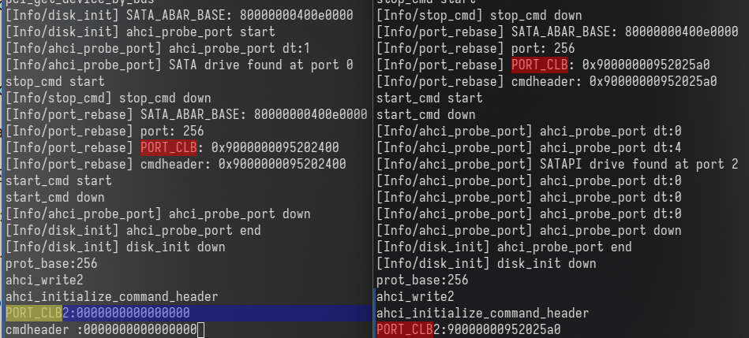

# 文件系统

在 kernel-travel 中文件系统采取多层次的实现方式



## 缓冲层

由于每次I/O操作要耗费大量的时间与计算机资源，因此设计缓冲层，尽量减少对于磁盘设备的访问。

缓冲层采取 LRU 的换出策略，使用动态分配内存的方式将经常用到的文件块保存在内存中，将长期不用的文件块从磁盘呢换出至磁盘内。

当物理内存的使用率达到一定程度后，由内核线程 bufSync 将缓冲区中的内容强制回写到磁盘中。

缓冲层以块为单位进行管理。将内存中的每512字节与磁盘上的一个扇区对应。


```c
typedef struct Buffer {
    unsigned long blockno;//控制块号
    int dev;
    bool valid;//缓冲区的有效标志
    bool dirty;//是否被写入的标志
    unsigned short disk;
    unsigned short refcnt;//引用计数
    BufferData *data;//缓冲区内存
    struct lock lock;//缓冲控制块锁
    struct list_elem Buffer_node;//链接到BufList中的节点
} Buffer;
```

```c
typedef struct BufferData {
    unsigned char data[BUF_SIZE];//BUF_SIZE = 512 
} BufferData;
```

## 簇层

因为FAT32文件系统会根据磁盘镜像的大小选取大小不同的簇。为了减少上层文件系统对扇区号的计算，在缓冲层的基础上又增添了簇层对于簇进行管理。

该层提供的主要功能是通过簇号来计算扇区号。

```c
unsigned long secno = clusterSec(fs, cluster) + offset / fs->superBlock.bpb.bytes_per_sec;
```

## 通用接口层

### 文件


### 目录

### fd

## 系统调用层

系统调用层在前文的基础上实现了部分文件系统的系统调用

```c
int sys_open(const char* pathname, int flags, mode_t mode);//打开文件
int sys_write(int fd, const void* buf, unsigned int count);//写文件
int sys_read(int fd, void* buf, unsigned int count);//读文件
int sys_close(int fd);//关闭文件
int sys_mkdir(char* path, int mode);//创建目录
char* sys_getcwd(char* buf, int size);
int sys_chdir(char* path);
int sys_unlink(char* pathname);
int sys_fstat(int fd, struct kstat* stat);
int sys_lseek(int fd, int offset, uint8_t whence);
int sys_dup(int oldfd);
int sys_dup2(uint32_t old_local_fd, uint32_t new_local_fd);
int sys_openat(int fd, const char* filename, int flags, mode_t mode);
int sys_mkdirat(int dirfd, const char* path, mode_t mode);
int sys_unlinkat(int dirfd, char* path, unsigned int flags);
int sys_mount(const char *special, const char *dir, const char *fstype, unsigned long flags, const void *data);
int sys_umount(const char* special);
```
