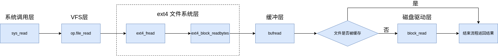

# 文件系统

在 kernel-travel 中文件系统采取多层次的实现方式


文件系统调用流程(以read为例)：


## 磁盘驱动层

在磁盘驱动层向上提供了读与写两个接口，上层程序只需向磁盘驱动程序提供要读写的起始扇区号与读取的物理扇区数量即可。

```c
void block_read(uint64_t base_addr, uint64_t count, uint64_t buffer, uint8_t port_num)
void block_write(uint64_t base_addr, uint64_t count, uint64_t buffer, uint8_t port_num) 
```

## 缓冲层

由于每次I/O操作要耗费大量的时间与计算机资源，因此设计缓冲层，尽量减少对于磁盘设备的访问。

缓冲层采取 LRU 的换出策略，使用动态分配内存的方式将经常用到的文件块保存在内存中，将长期不用的文件块从磁盘呢换出至磁盘内。

当物理内存的使用率达到一定程度后，由内核线程 bufSync 将缓冲区中的内容强制回写到磁盘中。

缓冲层以块为单位进行管理。将内存中的每512字节与磁盘上的一个扇区对应。


缓冲层维护了结构体 Buffer 用于记录缓冲区块的状态信息。

```c
typedef struct Buffer {
    unsigned long blockno;//控制块号
    int dev;
    bool valid;//缓冲区的有效标志
    bool dirty;//是否被写入的标志
    unsigned short disk;
    unsigned short refcnt;//引用计数
    BufferData *data;//缓冲区内存
    struct lock lock;//缓冲控制块锁
    struct list_elem Buffer_node;//链接到BufList中的节点
} Buffer;
```

其中成员 data 则指向真正用来存储的内存区域。

```c
typedef struct BufferData {
    unsigned char data[BUF_SIZE];//BUF_SIZE = 512 
} BufferData;
```

## VFS 层的设计

为了底层能更好的兼容多种文件系统，kernel-travel 参考 Linux 内核的设计，采取面向对象的设计思路在底层文件系统的基础上封装了 VFS 层。

### VFS 层维护的结构体

在vfs层维护了多种文件系统通用结构体。

#### FileSystem

FileSystem 在该结构体中记录了文件系统的状态信息。在文件系统初始化时被注册在全局数组 `struct FileSystem fs[MAX_FS_COUNT]` 中。

```c
typedef struct FileSystem {
    bool valid; // 是否有效
    char name[8];
    struct SuperBlock superBlock;                   // 超级块
    struct Dirent *root;                            // root项
    struct Dirent *mountPoint;                      // 挂载点，用于记录文件系统被安装的目录
    int deviceNumber;                               // 对应真实设备的编号
    struct Buffer *(*get)(struct FileSystem *fs, u64 blockNum, bool is_read); // 获取fs超级快的方式
    struct FileSystem* next;
    struct fs_operation* op;//文件系统的操作函数
}FileSystem;

```

文件系统注册与释放的接口：

```c
void allocFs(FileSystem **pFs); 
void deAllocFs(struct FileSystem *fs);
```

#### SuperBlock

SuperBlock用于记录文件系统中超级块的信息，在一个具体的文件系统被初始化时由初始化函数填写与验证。

```c
typedef struct SuperBlock {
    u32 first_data_sec;
    u32 data_sec_cnt;
    u32 data_clus_cnt;
    u32 bytes_per_clus;
    union 
    {
        struct bpb bpb;//fat32文件系统原生的超级块结构
        struct ext4_sblock ext4_sblock;//ext4原生的超级块结构
    };
}SuperBlock;

由于目前 kernel-travel 底层仅支持 Fat32 文件系统与 ext4，所以在超级块中使用联合体的形式来记录文件系统原生的超级块结构。

```

#### Dirent

Dirent 结构体主要用于维护 VFS 层中文件的目录树结构。

同时使用缓存的方式所有文件的 Dirent 记录在内存中，减少了系统对于对磁盘的访问，提高了查询文件或目录与解析路径的效率。

```c
typedef struct Dirent {
    union 
    {
        FAT32Directory raw_dirent; 	// fat32原生的dirent项
        struct ext4_dir_en ext4_dir_en;	// ext4文件系统原生的dirent项
    };
    char name[MAX_NAME_LEN];
    // 文件系统相关属性
    FileSystem *file_system;    // dir所在的文件系统
    unsigned int first_clus;    // 第一个簇的簇号（如果为0，表示文件尚未分配簇）
    unsigned int file_size;     // 文件大小
    struct vfsmount *head;      //挂载在当前目录下的mount结构体
    DirentPointer pointer;
    // 在上一个目录项中的内容偏移，用于写回
    unsigned int parent_dir_off;
    // 标记是文件、目录还是设备文件（仅在文件系统中出现，不出现在磁盘中）
    unsigned short type;
    unsigned short is_rm;
    // 文件的时间戳
    struct file_time time;
    // 设备结构体，可以通过该结构体完成对文件的读写
    struct FileDev *dev;
    // 子Dirent列表
    struct list child_list;
    struct list_elem dirent_tag; //链表节点，用于父目录记录
    // 父亲Dirent
    struct Dirent *parent_dirent; // 即使是mount的目录，也指向其上一级目录。如果该字段为NULL，表示为总的根目录
    u32 mode;
    // 各种计数
    unsigned short linkcnt; // 链接计数
    unsigned short refcnt;  // 引用计数
}Dirent;
```

一个Dirent结构要么被链接在 `dirent_free_list` 空闲队列里，要么被链接在目录树上。

该队列在 VFS 层初始化时被初始化。

```C
void dirent_init(void);//用于初始化 dirent_free_list 队列的函数
```

`Dirent` 结构的分配与回收

```C
Dirent *dirent_alloc(void);
void dirent_dealloc(Dirent *dirent); 
```

#### vfsmount

在 VFS 层中使用结构体 `vfsmount` 来记录挂载点信息。

```c
struct vfsmount {
    struct vfsmount *mnt_parent;        // 父文件系统，我们挂载在其上
    struct Dirent *mnt_mountpoint;      // 挂载点的目录项,位于父目录的目录上
    struct Dirent *mnt_rootdir;         // 挂载文件系统的根目录
    struct list_elem mnt_mounts;        // 子挂载点列表，用于父挂载点记录
    struct list mnt_child;              // 子挂载点列表
    const char *mnt_devname;            // 设备名称，例如 /dev/dsk/hda1
    int mnt_count;                      // 挂载点下被使用的引用计数，如果正在被使用则不能被卸载
    int mnt_expiry_mark;                // 标记是否被分配
};
```

其中根挂载点由全局变量 `mnt_root` 记录。而根挂载点中记录的 `mnt_rootdir` 则视为 VFS 目录树中的 / 。

### fs_operation

结构体 `fs_operation` 使用函数指针的方式将文件系统相关的所有函数记录在其中。由具体的文件系统对其需要的函数进行注册。

```c
/*文件系统相关的的操作函数*/
struct fs_operation{
    /*文件系统的初始化*/
    void (*fs_init_ptr)(FileSystem*);//指向文件系统初始化的指针
    /*文件操作*/
    void (*file_init)(struct Dirent *file);//文件被打开时的初始化部分
    int (*file_create)(struct Dirent *baseDir, char *path, Dirent **file);//创建文件
    int (*file_write)(struct Dirent *file, unsigned long src, unsigned int off, unsigned int n);//写文件 
    int (*file_read)(struct Dirent *file, unsigned long dst, unsigned int off, unsigned int n);//读文件
    int (*file_remove)(Dirent *file);//删除文件
    /*目录操作*/
    int (*makedir)(Dirent *baseDir, char *path, int mode);//创建目录
};
```

### VFS 层的操作

#### 路径解析

kernel-travel 对于路径解析的操作依赖于记录在内存中的目录树结构。其中包含路径的解析与查询两部分。

```c
char *path_parse(char *pathname, char *name_store);//解析路径
Dirent* search_file(const char *pathname, struct path_search_record *searched_record);//路径查询
Dirent* search_dir_tree(Dirent* parent,char *name);
```

其中 `search_file` 函数用于目录层级间的查询，而 `search_dir_tree` 则是对 `child_list` 中的内容进行查询

#### 文件系统的挂载

对于被挂载的文件系统在初始化时调用自己的 `build_dirent_tree` 函数构建属于自己文件系统的目录树。构建好之后，父文件系统的目录树上会使用一个 Dirent 结构连接到被挂载文件系统的根目录上。父目录树上 Dirent 结构中的成员 `struct vfsmount *head` 中记录了挂载点信息

.png)

```c
int mount_fs(char *special, char *dirPath, const char *fstype, unsigned long flags);
int umount_fs(char *dirPath);
```

其中文件系统注册的初始化函数会由 `mount_fs` 调用。

## 系统调用层

系统调用层在前文的基础上实现了部分文件系统的系统调用

### fd

kernel-travel 中通过 fd 结构体对文件描述符进行管理，其中记录了进程与对文件操作的情况。

```c
typedef struct fd {
    // 保证每个fd的读写不并发
    struct lock lock;
    struct Dirent *dirent;
    //struct Pipe *pipe;
    int type;            //文件类型
    unsigned int offset; //文件指针偏移
    unsigned int flags;
    struct kstat stat;
    unsigned int refcnt; // 引用计数
} fd;
```

在内核态中维护了结构体数组 file_table 作为全局文件描述符打开列表。而对于用户态程序，则在task_struct 中用 fd_table 数组记录，该数组存储了 fd 在全局文件描述符打开列表数组中对应的下标。


文件描述符0、1、2 分别为标准输入输出与错误，在thread_init中被初始化。

```c
enum std_fd {
   STDIN,   // 0 标准输入
   STDOUT,  // 1 标准输出
   STDERR   // 2 标准错误
};
```

提供的接口：

```c
int32_t get_free_slot_in_global(void);//获取空闲的全局文件描述符
int32_t pcb_fd_install(int32_t globa_fd_idx);//将全局文件描述符安装到进程的文件打开列表中
uint32_t fd_local2global(uint32_t local_fd);//获取全局文件描述符
int file_open(Dirent* file, int flag, mode_t mode)//打开文件描述符
int file_close(struct fd *_fd)//关闭文件描述符
```

### syscall实现

系统调用函数实现了初赛所给[系统调用说明](https://github.com/oscomp/testsuits-for-oskernel/blob/pre-2024/oscomp_syscalls.md)中所有文件系统相关的函数。

```c
int sys_open(const char* pathname, int flags, mode_t mode);//打开文件
int sys_write(int fd, const void* buf, unsigned int count);//写文件
int sys_read(int fd, void* buf, unsigned int count);//读文件
int sys_close(int fd);//关闭文件
int sys_mkdir(char* path, int mode);//创建目录
char* sys_getcwd(char* buf, int size);//获取当前工作目录
int sys_chdir(char* path);//修改工作目录
int sys_unlink(char* pathname);//删除文件
int sys_fstat(int fd, struct kstat* stat);//获取文件属性
int sys_lseek(int fd, int offset, uint8_t whence);//修改文件指针的偏移量
int sys_dup(int oldfd);//重定向
int sys_dup2(uint32_t old_local_fd, uint32_t new_local_fd);
int sys_openat(int fd, const char* filename, int flags, mode_t mode);
int sys_mkdirat(int dirfd, const char* path, mode_t mode);
int sys_unlinkat(int dirfd, char* path, unsigned int flags);
int sys_mount(const char *special, const char *dir, const char *fstype, unsigned long flags, const void *data);//挂载文件系统
int sys_umount(const char* special);//卸载文件系统
int sys_statx(int dirfd, const char *pathname, int flags, unsigned int mask, struct statx *buf);
int32_t sys_pipe(int32_t pipefd[2]);
int sys_getdents(int fd, struct linux_dirent64* buf, size_t len);
```
