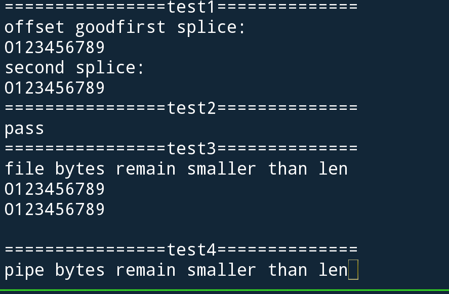

实现思路：

因为我们已经在read、write中已经实现了对管道的支持,能自动根据文件的类型读取或写入文件。所以只需要将一个文件里的东西读到buffer里中转，再写到另外一个文件即可。只不过需要写一个不更新offset的read。


测试：

因为板子上的读写驱动有问题，在qemu中自己写测试检验
我们首先在SOURCEFILE里写入两行的0123456789,作为测试的内容

```c
	int fd = openfile(AT_OPEN,SOURCEFILE,3,0);
```

测试一：
从文件传输数据到管道，检验一下管道中的数据是否是0123456789，看看数据是否已成功传输了。
还有再次使用splice函数,检验文件的偏移量是否发生了变化。以及测试是否得到正确的偏移量。

```c
	pstr("\n================test1==============\n");
	splice(fd,&in_off,p[0],NULL,10,0);
	if (in_off == 10) {
		pstr("offset good");
	}
	readfile(p[1],buf,10);
	buf[10]=0;
	pstr("first splice:\n");
	pstr(buf);
	pstr("\n");

	splice(fd,&in_off,p[0],NULL,10,0);
	readfile(p[1],buf,10);
	buf[10]=0;
	pstr("second splice:\n");
	pstr(buf);
	pstr("\n");
```

测试二：
这个测试从管道传10个字节到DESTFILE。通过把DESTFILE的前10个字节给读出来检验。
```c
	pstr("================test2==============\n");
	long written;
	splice(fd,0,p[0],NULL,10,0);
	int outfd = openfile(AT_OPEN,DESTFILE,3,0);
	splice(p[1],NULL,outfd,&written,10,0);
	readfile(outfd,buf,10);
	buf[5]=0;
	if (!ustrcmp("0123",buf)) {
		pstr("pass\n");
	}
```

测试三:
把len设置为100,显然比两行0123456789要大。如果能正常打印两行0123456789说明没问题。
```c
	pstr("================test3==============\n");
	pstr("file bytes remain smaller than len\n");
	splice(fd,&in_off,p[0],NULL,100,0);
	readfile(p[1],buf,30);
	buf[30]=0;
	pstr(buf);
	pstr("\n");
```

测试四：
从管道里读出100字节，因为管道中没那么多字节，所以预期结果会阻塞。
```c
	pstr("================test4==============\n");
	pstr("pipe bytes remain smaller than len");
	splice(fd,&in_off,p[0],NULL,10,0);
	splice(p[1],NULL,outfd,&out_off,100,0);
	readfile(outfd,buf,10);
	buf[10]=0;
	pstr(buf);

```


测试结果：





皆与预期一致。

