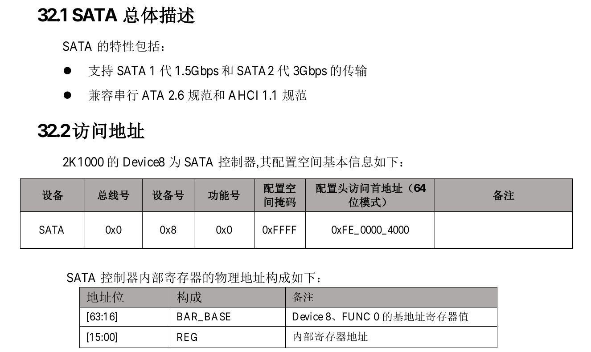

# 磁盘驱动

## 获取sata控制器的bar地址



根据手册中所给的信息要操作磁盘中的寄存器首先要获取磁盘的bar地址。根据ACHI1.1规范中给出的拓扑结构可知，该设备为PCI设备。因此要获取bar地址应先驱动pci总线，读取其配置空间中的信息，并根据手册给出的总线号设备号功能号查找到sata控制器的BAR_BASE地址。

### 读写配置信息

在用户手册中，将pci设备定义为普通pci设备（type0）与桥接设备（type1）。
在64位地址模式下，type0型设备配置头的基地址为0xfe00000000。type1则为0xfe10000000。

```c
#define PCI_CONFIG0_BASE 0xfe00000000
#define PCI_CONFIG1_BASE 0xfe10000000
```

在loongarch架构中采取统一编址的方式，因此在访问pci配置头空间时只需要计算出他们在内存中的地址即可。

访问外设时虚拟地址要使用0x8000000000000000作为基地址，加上设备头的基地址，以及总线号偏移，设备号偏移，功能号偏移，寄存器偏移，各自的偏移量最终形成存储该设备的配置信息的地址。

在《龙芯 2K1000LA 处理器用户手册》71页，图 6-432 中给出了具体的地址访问方式

```c
static void pci_read_config(unsigned long base_cfg_addr, unsigned int bus, unsigned int device, unsigned int function, unsigned int reg_id, unsigned int * read_data)
{
    unsigned long pcie_header_base = CSR_DMW0_BASE|base_cfg_addr| (bus << 16) | (device << 11)| (function<<8);
    *read_data = *(volatile unsigned int *)(pcie_header_base + reg_id) ; 
}

static void pci_write_config(unsigned long base_cfg_addr, unsigned int bus, unsigned int device, unsigned int function, unsigned int reg_id, unsigned int * write_data)
{
    unsigned long pcie_header_base = CSR_DMW0_BASE|base_cfg_addr| (bus << 16) | (device << 11)| (function<<8);
    *(volatile unsigned int *)( pcie_header_base + reg_id) = write_data;
    
}
```

### 解析bar地址

bar地址分为I/O空间与MEM两种类型。

该地址被存储在寄存器 Base Address Register 中，该寄存器中的位信息如下：

基地址寄存器

* Bit0:标志位，若为1则为io空间，若为0则为mem空间

I/O基地址寄存器:

* Bit1:保留
* Bit31-2:基地址单元
* Bit63-32:保留

MEM 基地址存储器:

* Bit2-1:MEM 基地址寄存器-译码器宽度单元,00-32 位,10-64 位
* Bit3:预提取属性
* Bit64-4:基地址单元

将无关位使用掩码屏蔽后就能得到pci设备的bar地址。

### 扫描pci设备

系统中定义了 pci_device_t 类型的结构体数组 pci_device_table 存储扫描到得 pci 设备信息。

```c
typedef struct pci_device
{
    int flags;     /*device flags标记该结构体是否被使用*/

    unsigned char bus;              /*bus总线号*/
    unsigned char dev;              /*device号*/
    unsigned char function;         /*功能号*/

    unsigned short vendor_id;       /*配置空间:Vendor ID*/
    unsigned short device_id;       /*配置空间:Device ID*/
    unsigned short command;         /*配置空间:Command*/
    unsigned short status;          /*配置空间:Status*/
    
    unsigned int class_code;        /*配置空间:Class Code*/
    unsigned char revision_id;      /*配置空间:Revision ID*/
    unsigned char multi_function;   /*多功能标志*/
    unsigned int card_bus_pointer;
    unsigned short subsystem_vendor_id;
    unsigned short subsystem_device_id;
    unsigned int expansion_rom_base_addr;
    unsigned int capability_list;
    
    unsigned char irq_line;     /*配置空间:IRQ line*/
    unsigned char irq_pin;      /*配置空间:IRQ pin*/
    unsigned char min_gnt;
    unsigned char max_lat;
    pci_device_bar_t bar[PCI_MAX_BAR];  /*有6个地址信息*/
} pci_device_t;
```

在系统初始化时调用pci_init()函数，将扫描总线上连接的所有的设备，读取它们的设备信息，并将其存储在结构体数组pci_device_table中。

### 获取设备信息

pci驱动程序向外提供多种接口，可以通过已知的设备信息获取存储设备信息的结构体。

```c
pci_device_t* pci_get_device(unsigned int vendor_id, unsigned int device_id);//通过设备id与厂商id获取设备信息
pci_device_t* pci_get_device_by_bus(unsigned int bus, unsigned int dev,unsigned int function);//通过总线号，设备号，功能号获取设备信息
```

## sata控制器的初始化

### 计算sata控制器的寄存器基地址

调用函数pci_get_device_by_bus，得到存储sata设备信息的结构体，从中读出bar地址并将其转换为虚拟地址。

```c
SATA_ABAR_BASE = 0x8000000000000000|pci_dev->bar[0].base_addr;
```

### 扫描磁盘端口

sata控制器的pi寄存器中存储了端口信息。pi寄存器共有32位，也说明最大只支持32各磁盘端口。每个 bit 位标记了对应的该端口是否有磁盘存在。

当识别到这个端口有磁盘连接后，根据签名寄存器 SIG 中的内容来识别磁盘设备的类型。

```c
#define SATA_SIG_ATA 0x00000101 // 普通的 SATA 硬盘驱动器
#define SATA_SIG_ATAPI 0xEB140101 // SATAPI设备，识别支持 ATAPI 协议的 SATA 设备
#define SATA_SIG_SEMB 0xC33C0101 // 桥接设备
#define SATA_SIG_PM 0x96690101 // 表示端口倍增器，用于扩展SATA接口，允许连接多个设备到单个SATA端口上。

```

### 设置sata控制器的寄存器

sata控制器的中断的分为全局中断和各个端口各自的中断。

```c
*(unsigned int *)(SATA_ABAR_BASE|HBA_GHC) |= HBA_GHC_IE;//全局中断使能
*(unsigned int *)(SATA_ABAR_BASE|HBA_GHC) |= HBA_GHC_AHCI_ENABLE;//启用ahci协议
```

在使用端口前，要先打开该端口的命令引擎，在qemu中共连接了两个虚拟磁盘，分别为2kfs.img与sdcard.img 分别对应端口 port0 与 port1。

由于测试文件被放在sdcard.img（port1），所以需要打开port1读取磁盘内容以供后续测试。

```c
static void start_cmd(unsigned long prot_base)
{

    // Wait until CR (bit15) is cleared
    while (*(unsigned int *)(SATA_ABAR_BASE|(prot_base+PORT_CMD)) & HBA_PxCMD_CR);

    // Set FRE (bit4) and ST (bit0)
    *(unsigned int *)(SATA_ABAR_BASE|(prot_base+PORT_CMD)) |= HBA_PxCMD_FRE;// 开启端口的接收
    *(unsigned int *)(SATA_ABAR_BASE|(prot_base+PORT_CMD)) |= HBA_PxCMD_ST;//开启向端口输入命令
}

```

要发送命令首先要将命令基地址填入命令列表基地址寄存器CLB

```c
*(unsigned long *)(SATA_ABAR_BASE|(port+PORT_CLB)) = ahci_port_base_vaddr + (portno << 10);
```

将fis命令基址填入FIS 基地址寄存器FIS

```c
 *(unsigned long *)(SATA_ABAR_BASE|(port+PORT_FB)) = ahci_port_base_vaddr + (32 << 10) + (portno << 8);

```

## 磁盘读写

### 设置寄存器

* 初始化HBA命令头
* 初始化HBA命令表
* 初始化FIS

### 选择命令槽位

一个端口中有32个命令槽位，将对应的bit位置1后代表有命令要从该槽位发出。等到该bit位被恢复为0后，则说明对应的命令已经被发出。

在发送前要选择空闲的命令槽位并将其置位为1。
