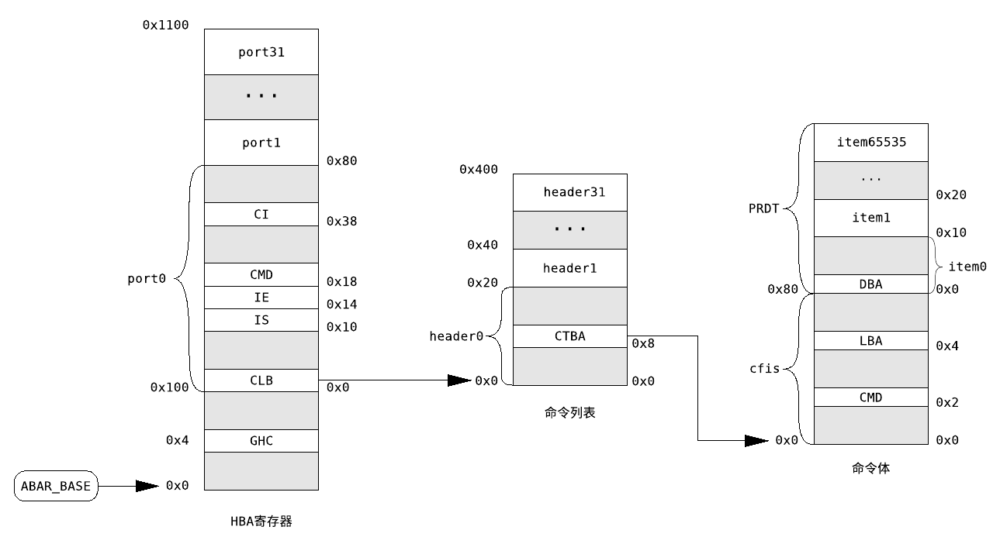

# 磁盘驱动

## 获取sata控制器的bar地址


根据手册中所给的信息要操作磁盘中的寄存器首先要获取磁盘的bar地址。根据ACHI1.1规范中给出的拓扑结构可知，该设备为PCI设备。因此要获取bar地址应先驱动pci总线，读取其配置空间中的信息，并根据手册给出的总线号设备号功能号查找到sata控制器的BAR_BASE地址。

## sata控制器的初始化

### 计算sata控制器的寄存器基地址

调用函数pci_get_device_by_bus，得到存储sata设备信息的结构体，从中读出bar地址并将其转换为虚拟地址。

```c
SATA_ABAR_BASE = 0x8000000000000000|pci_dev->bar[0].base_addr;
```

sata 控制器相关的地址空间布局（图来自兰州大学 MaQueOs 文档）



### 扫描磁盘端口

sata控制器的pi寄存器中存储了端口信息。pi寄存器共有32位，也说明最大只支持32各磁盘端口。每个 bit 位标记了对应的该端口是否有磁盘存在。

当识别到这个端口有磁盘连接后，根据签名寄存器 SIG 中的内容来识别磁盘设备的类型。

```c
#define SATA_SIG_ATA 0x00000101 // 普通的 SATA 硬盘驱动器
#define SATA_SIG_ATAPI 0xEB140101 // SATAPI设备，识别支持 ATAPI 协议的 SATA 设备
#define SATA_SIG_SEMB 0xC33C0101 // 桥接设备
#define SATA_SIG_PM 0x96690101 // 表示端口倍增器，用于扩展SATA接口，允许连接多个设备到单个SATA端口上。

```

### 设置sata控制器的寄存器

sata控制器的中断的分为全局中断和各个端口各自的中断。

```c
*(unsigned int *)(SATA_ABAR_BASE|HBA_GHC) |= HBA_GHC_IE;//全局中断使能
*(unsigned int *)(SATA_ABAR_BASE|HBA_GHC) |= HBA_GHC_AHCI_ENABLE;//启用ahci协议
```

在使用端口前，要先打开该端口的命令引擎，在qemu中共连接了两个虚拟磁盘，分别为2kfs.img与sdcard.img 分别对应端口 port0 与 port1。

由于测试文件被放在sdcard.img（port1），所以需要打开port1读取磁盘内容以供后续测试。

```c
static void start_cmd(unsigned long prot_base)
{

    // Wait until CR (bit15) is cleared
    while (*(unsigned int *)(SATA_ABAR_BASE|(prot_base+PORT_CMD)) & HBA_PxCMD_CR);

    // Set FRE (bit4) and ST (bit0)
    *(unsigned int *)(SATA_ABAR_BASE|(prot_base+PORT_CMD)) |= HBA_PxCMD_FRE;// 开启端口的接收
    *(unsigned int *)(SATA_ABAR_BASE|(prot_base+PORT_CMD)) |= HBA_PxCMD_ST;//开启向端口输入命令
}

```

要发送命令首先要将命令基地址填入命令列表基地址寄存器CLB

```c
*(unsigned long *)(SATA_ABAR_BASE|(port+PORT_CLB)) = ahci_port_base_vaddr + (portno << 10);
```

将fis命令基址填入FIS 基地址寄存器FIS

```c
 *(unsigned long *)(SATA_ABAR_BASE|(port+PORT_FB)) = ahci_port_base_vaddr + (32 << 10) + (portno << 8);

```

## 磁盘读写

### 设置寄存器

* 初始化HBA命令头
* 初始化HBA命令表
* 初始化FIS

### 选择命令槽位

一个端口中有32个命令槽位，将对应的bit位置1后代表有命令要从该槽位发出。等到该bit位被恢复为0后，则说明对应的命令已经被发出。

在发送前要选择空闲的命令槽位并将其置位为1。

### 等待命令发送

待命令发送成功后寄存器 SACT 中对应的位被置0。

```c
while (1)
    {
        printk("");
    if (!(*(unsigned int*)(SATA_ABAR_BASE | (prot_base + PORT_CI)) | *(unsigned int*)(SATA_ABAR_BASE | (prot_base + PORT_SACT)) &(1 << slot))) 
        {
            break;
        }
        if (*(unsigned int *)(SATA_ABAR_BASE|(prot_base+PORT_IS)) & HBA_PxIS_TFES) // 如果HBA_PxIS_TFES被置位则说明访问异常
        {
            printk("Read disk error");
            return E_TASK_FILE_ERROR;
        }
    }
```

### 错误处理

寄存器 IS 中若第30个 bit 被置位为1，则说明磁盘的读写发生了错误。
