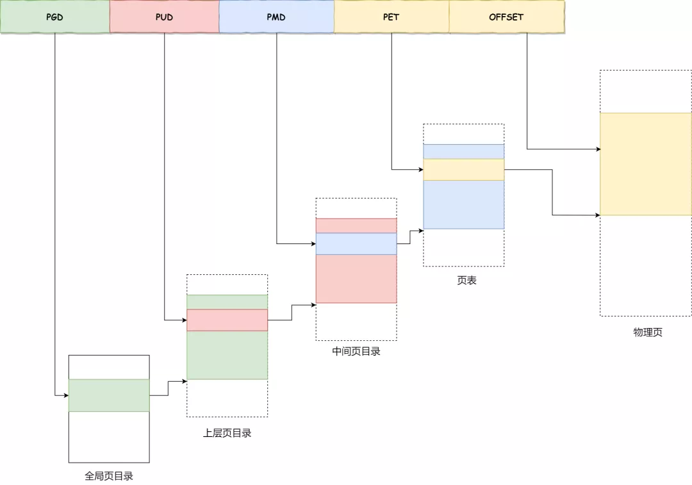

# 虚拟内存管理

在特权级为0时，使用DWM窗口将0x900...的地址进行直接映射，其余进行页表映射，而在特权级别为3的用户进程，则使用页表进行映射。

## 页表映射

每个进程的 pgdir 存储在当前进程的PCB（struct task_struct）的`pgdir`成员中。

kernel-travel 采用的是三级页表进行页表映射。使用pgd（9位），pmd（9位）,pte（9位）和phy_page（12位），因此用户进程的最大地址空间就是`#define USER_TOP   ((1UL << (9+9+9+12)))`。


以下为页表的核心处理逻辑函数:
```c
u64 *pgd_ptr(u64 pd,u64 vaddr);
u64 *pmd_ptr(u64 pd,u64 vaddr);
u64 *pte_ptr(u64 pd,u64 vaddr);
// 采用 page_table_add 函数来为其 pgd 分配对应的页表
void page_table_add(u64 pd,u64 _vaddr,u64 _paddr,u64 attr)
// 也提供了从虚拟地址到物理地址的映射关系，核心函数是
u64 vaddr_to_paddr(u64 pd, u64 vaddr);
```


## 进程的虚拟内存管理

kernel-travel 中虚拟内存管理的框架基于目前的Linux内核的虚拟内存管理思想，以VMA为基本单位，使用红黑树和双向链表进行管理。VMA的最小粒度为PAGE_SIZE，比如代码从`0x1234`到`0x2100`，则代码段的VMA维护的地址为`0x1000`到`0x3000`。


每个进程的 task_struct 中的 mm_struct 负责当前进程的虚拟内存管理。
```c
struct mm_struct {
	// 串联组织进程空间中所有的 VMA  的双向链表 
	unsigned long mmap_base;
	struct vm_area_struct *mmap;  /* list of VMAs */
	// 管理进程空间中所有 VMA 的红黑树
	struct rb_root mm_rb;
	struct vm_area_struct * mmap_cache;
	unsigned long free_area_cache;	/*记录上次成功分配的起始地址的缓存*/
	unsigned long total_vm;		/*vm总数*/
	/*代码段，数据段，bss段，堆，栈，参数对应的虚拟地址的开始地址和结束地址*/
	unsigned long start_code, end_code, start_data, end_data;
	unsigned long start_brk, brk, start_stack;
	unsigned long arg_start, arg_end, env_start, env_end;
	unsigned long map_count;
	unsigned long (*get_unmapped_area) (struct file *filp,
				unsigned long addr, unsigned long len,
				unsigned long pgoff, unsigned long flags);
	unsigned long rss;
	struct file * vm_file;		/* 映射的文件，匿名映射即为nullptr*/
};
```

每个进程的不同段：代码段，数据段，bss段，堆，文件映射与匿名映射区，栈，内核空间都是由 `struct vm_area_struct` 进行管理的，每个`struct vm_area_struct`之间通过循环链表和一个红黑树进行统一管理。

```c
// 虚拟内存区域描述符
struct vm_area_struct {
	struct mm_struct * vm_mm;
	unsigned long vm_start;		// VMA 的开始虚拟地址
	unsigned long vm_end;		// VMA 结束虚拟地址
	// vma 在 mm_struct->mmap 双向链表中的前驱节点和后继节点
	struct vm_area_struct *vm_next, *vm_prev;
	// vma 在 mm_struct->mm_rb 红黑树中的节点
	struct rb_node vm_rb;
	// pgprot_t vm_page_prot;
	unsigned long vm_flags; 	/*指定内存映射方式*/
	struct file * vm_file;		/* File we map to (can be NULL). */
	unsigned long vm_pgoff;		/* Offset (within vm_file) in PAGE_SIZE */
};
```

在一个进程从磁盘文件加载并且运行的时候，通过读取ELF文件的程序头，根据对应的权限将其加载到当前进程的虚拟内存空间中（代码段和数据段），而比如bss段，堆，栈，文件与匿名映射区都是由内核进行直接分配的：

## mmap 的核心处理逻辑

```c
unsigned long do_mmap_pgoff(struct file * file, unsigned long addr,
			unsigned long len, unsigned long prot,
			unsigned long flags, unsigned long pgoff)
{
	// ... 初始化
	// 获取当前没有分配的虚拟内存
	addr = running_thread()->mm->get_unmapped_area(file, addr + TASK_UNMAPPED_BASE, len, pgoff, flags);

	// ...对应参数的具体处理
	
	/*检查是否超过地址空间虚拟地址用量的限制
	* 如果超过报异常*/
	check_vaddr_limit();

	/*检查是否有重叠映射：
	* 如果有就解除旧的映射*/
	find_vma_links();

	/*获取 addr 对应 VMA*/
	vma = find_vma_prepare(mm, addr, &prev, &rb_link, &rb_parent);


	/*尝试与相邻的VMA进行合并
	* 可以合并：返回*/
	vma = vma_merge(mm, prev, addr, addr + len, flags,
		NULL, file, pgoff);
 
	// ... 
	/*如果为空则 VMA 分配物理内存并初始化*/
	vma = (struct vm_area_struct *)get_page();
	memset(vma, 0, sizeof(*vma));
	vma->vm_mm = mm;
	vma->vm_start = addr;
	vma->vm_end = addr + len;
	vma->vm_flags = flags;
	vma->vm_pgoff = pgoff;


	// ... 文件映射和匿名映射逻辑的具体处理

	/*建立VMA和红黑树，文件页等映射*/
 	vma_link(mm, vma, prev, rb_link, rb_parent);

out:
	/*更新 mm_struct 的统计信息*/
	mm->total_vm += len >> PAGE_SHIFT;
	return addr;
}
```

通过mmap系统调用将读取的ELF文件中的数据段，代码段以及分配的堆栈，bss段进行虚拟内存管理，保证进程的虚拟地址不会出现冲突与错误，保证其一致性。这里mmap使用预先分配物理内存的方式。

虚拟内存的红黑树维护和双向链表的维护逻辑主要在`vma_link`函数中，请查阅`Red_Black_Tree.md`。

## Init 进程的虚拟内存布局

Init进程也是从磁盘读取后运行的，它的虚拟内存地址维护和普通进程相同，下面是目前Init进程的地址空间拓扑结构：

```
    在init进程中,经调试虚拟内存管理工作正常,其红黑树拓扑结构:

                 heap
                /    \
            .text   stack
            .data      \
                      arg

    init 进程的 .text,.data 同一个程序头,地址范围(rb_node: 0x90000000a100e028 ):
        0x0 - 0x14a0
    heap地址范围(rb_node: 0x90000000a1010028):
        0x7f0000000 - 0x7f0040000
    stack地址范围(rb_node: 0x90000000a100f028):
        0x7fffffd000 - 0x7fffffe000
    arg地址范围(rb_node: 0x90000000a1011028):
        0x7fffffe000 - 0x8000000000
```