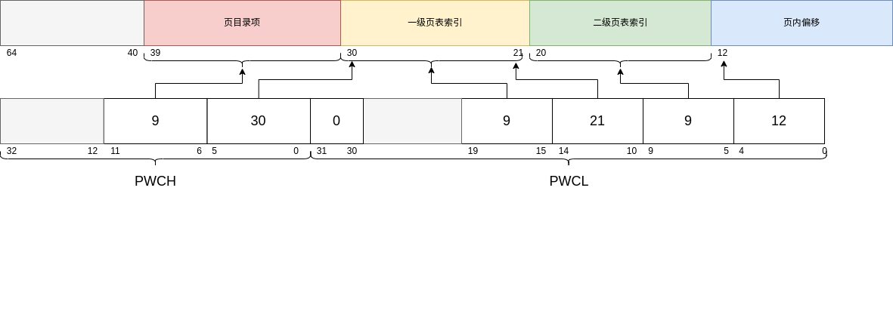
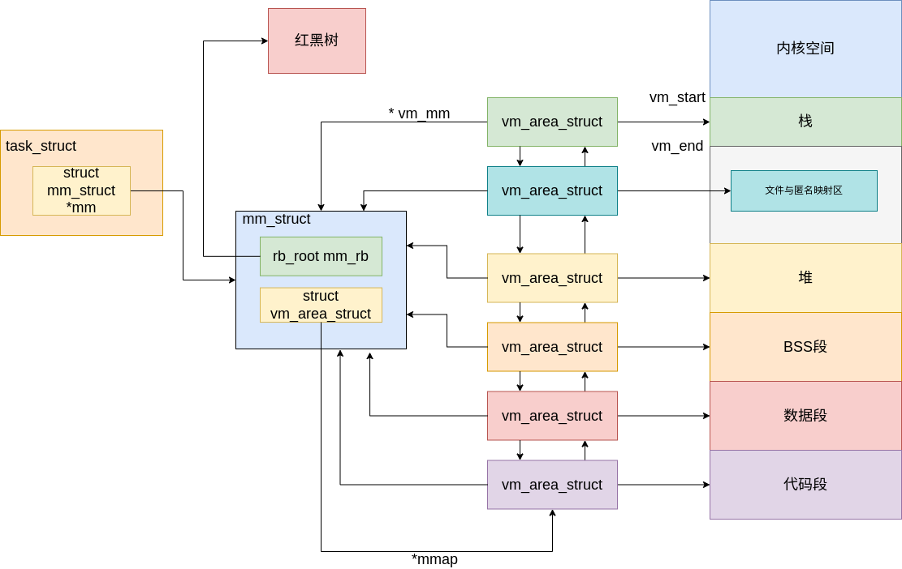

# 虚拟内存管理

在特权级为0时，使用DWM窗口将0x900...的地址进行直接映射，其余进行页表映射，而在特权级别为3的用户进程，则使用页表进行映射。

## 页表映射

kernel-travel 采用的是三级页表进行页表映射。



以下为页表的核心处理逻辑函数:

```c
u64 *pgd_ptr(u64 pd,u64 vaddr)
{
	return (u64*)(pd + PGD_IDX(vaddr) * ENTRY_SIZE);
}

u64 *pmd_ptr(u64 pd,u64 vaddr)
{
	u64 pmd;
	u64 *pgd = pgd_ptr(pd,vaddr);
	if(*pgd)
		pmd = *pgd | CSR_DMW1_BASE;
	else {
		pmd = get_page();
		*pgd = pmd;
	}
	return (u64*)(pmd + PMD_IDX(vaddr) * ENTRY_SIZE);
}

u64 *pte_ptr(u64 pd,u64 vaddr)
{
	u64 pt;
	u64 *pmd = pmd_ptr(pd,vaddr);
	if (*pmd)
		pt = *pmd | CSR_DMW1_BASE;
	else {
		pt = get_page();
		*pmd = pt;
	}
	return (u64*)(pt + PTE_IDX(vaddr) * ENTRY_SIZE);
}
```

以此给用户进程分配物理页面，在进程初始化时候，采用 page_table_add 函数来为其 pgd 分配对应的页表

```c
void page_table_add(u64 pd,u64 _vaddr,u64 _paddr,u64 attr)
{
	u64 *pte = pte_ptr(pd,_vaddr);
	if (*pte) {
		printk("page_table_add: try to remap!!!\n");
		BUG();
	}
	*pte = _paddr | attr;
	// 刷新 TLB
	invalidate();
}
```

也提供了从虚拟地址到物理地址的映射关系，核心函数是:

```c
u64 vaddr_to_paddr(u64 pd, u64 vaddr) {
	u64 *pte = reverse_pte_ptr(pd, vaddr);
	if (!pte || !*pte) {
		printk("vaddr_to_paddr: Invalid virtual address mapping\n");
		return 0; // 或者返回一个错误码
	}
	return (*pte & ~0xfff) | PAGE_OFFSET(vaddr);
}
```

## 进程的虚拟内存管理

kernel-travel 中虚拟内存管理的框架



每个进程的 task_struct 中的 mm_struct 负责当前进程的虚拟内存管理。
```c
struct mm_struct {
	// 串联组织进程空间中所有的 VMA  的双向链表 
	unsigned long mmap_base;
	struct vm_area_struct *mmap;  /* list of VMAs */
	// 管理进程空间中所有 VMA 的红黑树
	struct rb_root mm_rb;
	struct vm_area_struct * mmap_cache;
	unsigned long free_area_cache;	/*记录上次成功分配的起始地址的缓存*/
	unsigned long total_vm;
	unsigned long start_code, end_code, start_data, end_data;
	unsigned long start_brk, brk, start_stack;
	unsigned long arg_start, arg_end, env_start, env_end;
	unsigned long map_count;
	unsigned long (*get_unmapped_area) (struct file *filp,
				unsigned long addr, unsigned long len,
				unsigned long pgoff, unsigned long flags);
	unsigned long rss;
	struct file * vm_file;		/* 映射的文件，匿名映射即为nullptr*/
};
```

每个进程的不同段：代码段，数据段，bss段，堆，文件映射与匿名映射区，栈，内核空间都是由 `struct vm_area_struct` 进行管理的，每个`struct vm_area_struct`之间通过循环链表和一个红黑树进行统一管理。

```c
// 虚拟内存区域描述符
struct vm_area_struct {
	struct mm_struct * vm_mm;
	unsigned long vm_start;		// VMA 的开始虚拟地址
	unsigned long vm_end;		// VMA 结束虚拟地址
	// vma 在 mm_struct->mmap 双向链表中的前驱节点和后继节点
	struct vm_area_struct *vm_next, *vm_prev;
	// vma 在 mm_struct->mm_rb 红黑树中的节点
	struct rb_node vm_rb;
	// pgprot_t vm_page_prot;
	unsigned long vm_flags; 	/*指定内存映射方式*/
	struct file * vm_file;		/* File we map to (can be NULL). */
	unsigned long vm_pgoff;		/* Offset (within vm_file) in PAGE_SIZE */
	// void * vm_opts;
};
```
所有的 vm_area_struct 都是使用 mmap 系统调用进行初始化，将其初始化到其进程控制块中，统一进行管理。

## mmap 的核心处理逻辑

```c
unsigned long do_mmap_pgoff(struct file * file, unsigned long addr,
			unsigned long len, unsigned long prot,
			unsigned long flags, unsigned long pgoff)
{
	struct mm_struct *mm = running_thread()->mm;	/* 获取该进程的memory descriptor*/
	struct vm_area_struct *vma, *prev;
	struct rb_node ** rb_link, * rb_parent;
	unsigned long *v_addr = (unsigned long *)VADDR_FOR_FD_MAPP;
	u64 offset = 0;

	len = PAGE_ALIGN(len);
	if (!len)
		return -1;
	if ((pgoff + (len >> PAGE_SHIFT)) < pgoff)
		return -1;
	/*如果超过最大 map 数量*/
	if (mm->map_count > sysctl_max_map_count)
		return -1;
	/*查找没被分配的虚拟地址*/
	addr = running_thread()->mm->get_unmapped_area(file, addr + TASK_UNMAPPED_BASE, len, pgoff, flags);

	/*根据 file 和 flages 设置最终的 vm_flags*/

	/*用于后续扩展*/
	if (file) {
		unsigned long flags_mask;

		if (!file_mmap_ok(file, pgoff, len))
			return -EOVERFLOW;

		flags_mask = LEGACY_MAP_MASK;

		switch (flags & MAP_TYPE) {
		case MAP_SHARED:
			break;
		case MAP_PRIVATE:
			break;
		default:
			return -EINVAL;
		}
	} else {
		switch (flags & MAP_TYPE) {
		case MAP_SHARED:
			break;
		case MAP_PRIVATE:
			break;
		default:
			return -EINVAL;
		}
	}

	/*检查是否超过地址空间虚拟地址用量的限制
	* 如果超过报异常*/
	check_vaddr_limit();

	/*检查是否有重叠映射：
	* 如果有就解除旧的映射*/
	// find_vma_links();
		/*do_munmap 解除映射*/

	/*获取 addr 对应 VMA*/
	vma = find_vma_prepare(mm, addr, &prev, &rb_link, &rb_parent);


	/*尝试与相邻的VMA进行合并
	* 可以合并：返回*/
	// vma = vma_merge(mm, prev, addr, addr + len, flags,
	// 	NULL, file, pgoff);
 
	/*初始化 VMA 结构
	* 文件映射： call_mmap
	* 共享匿名映射: shmem_zero_setup
	* 私有匿名映射: vma_set_anonyumous*/

	/*VMA 分配物理内存并初始化*/
	// printk("0x%llx\n",running_thread());
	// malloc_usrpage(running_thread()->pgdir, (unsigned long)vma);
	vma = (struct vm_area_struct *)get_page();
	memset(vma, 0, sizeof(*vma));
	vma->vm_mm = mm;
	vma->vm_start = addr;
	vma->vm_end = addr + len;
	vma->vm_flags = flags;
	vma->vm_pgoff = pgoff;


	if(file) {
		// call_mmap();	FAT32 的处理函数...
		fd_mapping(file->fd, pgoff, pgoff + (len >> 12), v_addr);
		int i = len >> 12;
		offset = *v_addr & (~PAGE_MASK);
		while (i--) {
			page_table_add(running_thread()->pgdir, addr,
					v_addr[i], PTE_V | PTE_PLV | PTE_D);
		}
		addr |= offset;
	} else if (flags & VM_SHARED) {
	
	} else {

	}
	/*建立VMA和红黑树，文件页等映射*/
 	vma_link(mm, vma, prev, rb_link, rb_parent);

out:
	/*更新 mm_struct 的统计信息*/
	mm->total_vm += len >> PAGE_SHIFT;
	return addr;
}
```

通过mmap系统调用将读取的ELF文件中的数据段，代码段以及分配的堆栈，bss段进行虚拟内存管理，保证进程的虚拟地址不会出现冲突与错误，保证其一致性。
