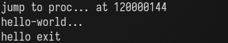

# Busybox 适配

## 环境配置

### 安装工具链muslc

1. 下载 LoongArch musl libc库

   ```sh
   git clone https://github.com/LoongsonLab/oscomp-musl-1.2.4.git
   cd ./oscomp-musl-1.2.4
   ```

2. 配置编译参数

   ```sh
   ./configure --target=loongarch64-linux-gnu CFLAGS="-mabi=lp64d" --prefix=/opt/loongarch-muslc
   ```

   `--prefix=/opt/loongarch-muslc`：这个选项指定了安装路径。配置后的软件包将安装到 /opt/loongarch-muslc 目录下。

3. 编译安装

   ```sh
   make -j 16
   make install -j 16
   ```

### busybox 编译

1. 下载 Linux 并引入相关头文件

   下载 [Linux源码](https://mirrors.edge.kernel.org/pub/linux/kernel/)

   进入 Linux 源码的目录后执行以下指令

   ```sh
   make ARCH=loongarch INSTALL_HDR_PATH=../temp headers_install
   ```

2. 更改busybox的Makefile

   ```sh
   CFLAGS		:= $(CFLAGS) -I /**/include
   LDFLAGS		:= $(LDFLAGS) -L/**/lib
   ```

3. 修改编译选项

   ```sh
   make defconfig
   CONFIG_TC=y ==> CONFIG_TC=n

   nvim scripts/kconfig/lxdialog/check-lxdialog.sh
   main ==> int main()
   ```

   ```sh
   make menuconfig 设置静态编译
   ```

4. 编译生成可执行程序

   ```sh
   make  CROSS_COMPILE=musl- -j 16
   make  CROSS_COMPILE=musl- install -j 16
   ```

## 适配 muslc

由于 busybox 是一个复杂的用户程序，为了验证muslc的适配情况并方便后续调试，我们先对 printf 函数进行了支持。

在此基础上编写了一个小 demo.

```c
//user_prog.c
int main(void)
{
	int count = 0 ;
	char filepath[20];

	umemset(filepath,0,sizeof(filepath));
	ustrcpy(filepath,"/sdcard/hello");
	char *argv[] = {"/sdcard/hello", NULL};
	char *envp[] = {NULL};
	//ustrcpy(argv[1],"sh");
	
	int pid = fork();
	if (pid == 0){
		execve(filepath,(char**)argv,NULL);
	}

	int status;
	int childpid = wait(&status);
	write(1,"\nhello exit\n",64);
	while(1) {
	}
}
```

用户程序 hello.c

```c
#include <stdio.h>

int main()
{
    printf("hello-world...\n")
}
```

运行结果：



## 支持busybox中的指令

运行到 busybox 界面：

